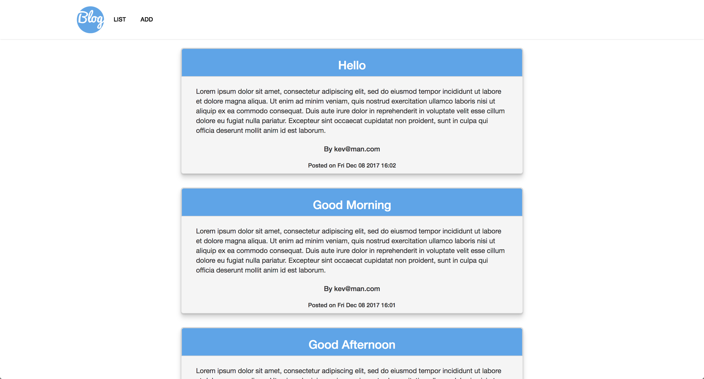

# GVA Blog

<kbd></kbd>

Blog that I created as part of a job interview take home project.

## Features
- Users can upload posts with a Title, Description, Email, and Text Body
- Posts can be viewed by most recently added
- From the command line, you my also view the 5 most recent posts in the command line by typing the command `list`

## Technologies
Node.js, Express, HTML5, CSS3

## Setup
Clone this repo to your desktop and from repository root directory run `npm install` to install all the dependencies.

---

## Usage

Once the dependencies are installed, you can run  `npm start` from the root directory to start the application.

You will then be able to view the web app at:

localhost:3000

OR

https://gva-blog.herokuapp.com
